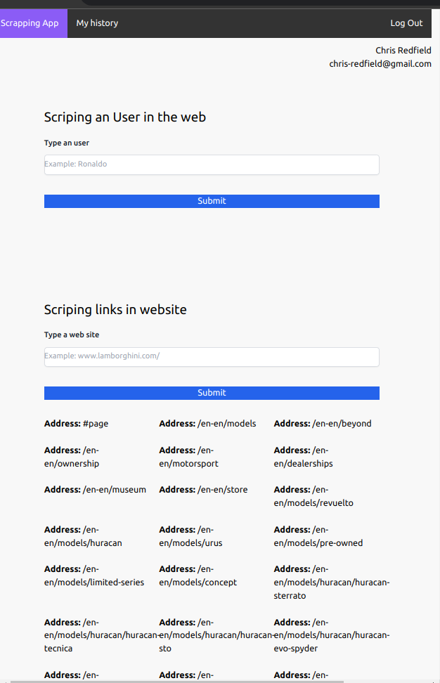
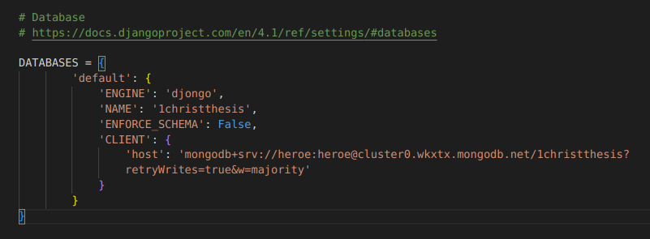

<div>
    
</div>

# Proyecto de Titulación


:star: ¡Dame una estrella en GitHub!

Este es un proyecto profesional dedicado para el trabajo de grado de mi Tesis. Todo la documentación completa se detalla y se especifica en este repositorio el cual existe todo el código realizado. Todo el código fuente es de código libre y puede ser personalizado en cualquier aspecto según tus necesidades.

<!--  -->

<div>
    
</div>

## Tabla de Contenidos

- [Instalación](#instalación)
  - [Crear el entorno virtual](#Crear-el-entorno-virtual)
  - [Levantar el entorno de Django](#levantar-el-entorno-de-Django)
- [Configuración](#configuración)
  - [Configuración de la Base de Datos](#configuración-de-la-base-de-datos)
- [Rutas](#rutas)
  - [Rutas disponibles](#rutas-disponibles)
- [Licencia](#licencia)

## Instalación

Este documento es para la última versión de Django **4.1.1 y posteriores**.

- ¡Se requiere python 3.1+!

### Crear el entorno virtual

**Nota:** El entorno se levanto en un entorno linux

Crear el entorno virtual instalando en las librerías para el entorno desarrollado en python, sigue los siguientes pasos:

```shell
sudo apt-get install -y python3-venv

# Crear la carpeta que alberga las librerías de python
python -m venv env

# Activa el entorno virtual
source env/bin/activate

# Instala los librerías de python especificadas en requirements.txt
pip install -r requirements.txt

```

## Levantar el entorno de Django

Los siguientes comandos sirven para levantar el proyecto de Django, migrar la base de datos y desplegar el servidor, a continuación

```shell
# Realizar las migraciones a un archivo .py
python manage.py makemigrations

# Crear la migraciones hacia la base de datos
python manage.py migrate

# Ejecutar el servidor
python manage.py runserver
```

### Configuración

## Configuración de la Base de Datos

Para establecer conexion con la base de datos se require establecer conexion srv de MongoDB Cluster



### Rutas

## Rutas disponibles

```shell
# backend
GET /api/auths
POST /api/auths
PUT /api/auths
DELETE /api/auths

# frontend
GET /
POST /
GET /signup
POST /signup
POST /scrapping

```

## License

La aplicación está licenciada bajo los términos de la licencia de código abierto y está disponible de forma gratuita.
